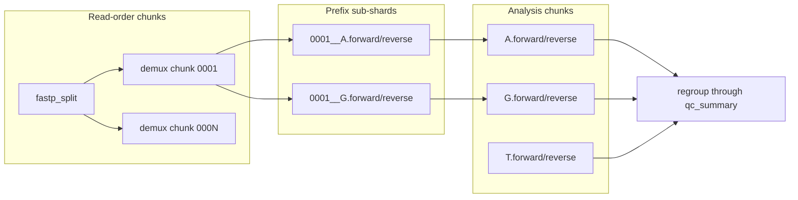

# Chunk and shard model

How read-order chunks, barcode-prefix analysis chunks, gather stages, and barcode-selection modes interact. For stable I/O paths per stage, see [`contracts.md`](contracts.md).

## Read-order chunk vs analysis chunk

| Concept | Key / ID | Role |
|---------|----------|------|
| Read-order chunk | numeric `0001..N` from `number_of_split_parts` | `fastp_split` + parallel `demux_extract_bc` input only |
| Analysis chunk | barcode prefix from `split_fastq_prefix_bases` (default `1`) | all stages from `regroup_shards` through `qc_summary` |

With DD-MET5 barcodes (no `C`), `split_fastq_prefix_bases=1` yields up to 3 analysis chunks (`A`, `G`, `T`). Each cell barcode maps to exactly one prefix; regrouped shards are disjoint by barcode.

## Manifest

`work/<sample>/demux/chunks.tsv` lists analysis chunks after `regroup_shards`:

| Column | Description |
|--------|-------------|
| `chunk_id` | analysis chunk ID (equals barcode prefix, e.g. `A`) |
| `prefix` | barcode prefix |
| `stream` | `forward` or `reverse` |
| `subshard_count` | number of read-order sub-shards merged |
| `subshard_paths` | source paths under `demux/shards/` |

## Directory layout

- **During demux:** prefix sub-shards live under `work/<sample>/demux/shards/` as `<readchunk>__<prefix>.{forward,reverse}_{1,2}.fq.gz`.
- **After regroup:** one paired FASTQ set per prefix at top-level `work/<sample>/demux/<prefix>.{forward,reverse}_{1,2}.fq.gz`.
- Downstream stages discover analysis chunks from top-level `demux/<prefix>.*` only (not `demux/shards/`).

## Gather stages

Stages that consume all analysis chunks (`saturation`, `qc_summary`, and similar) **gather** per-chunk outputs by globbing chunk directories. They do **not** deduplicate barcodes across chunks — a barcode never appears in more than one prefix shard.

Per-chunk stages (`bismark_align`, `split_bams`, `merge_fr_bams`, `bam_to_allc`, etc.) run once per analysis chunk. Sample-wide unions of filtered barcodes or merged BAMs across chunks are out of scope for those stages unless noted in [`stage_notes/`](stage_notes/).

## Barcode selection {#barcode-selection}

Downstream step3 stages require a cell barcode list for `split_bams`. Configure **exactly one** of:

| Mode | Workflow key | Stage path |
|------|--------------|------------|
| Methylation-only (default) | `expected_cell_num` (default `3000`) | `count_mapped_reads` → `estimated_cells` → `split_bams` |
| RNA + methylation | `gexcb` (path to RNA filtered barcodes) | `split_bams` only |

If neither key is set, `expected_cell_num=3000` applies. Setting both `gexcb` and `expected_cell_num` is an error.

`count_mapped_reads` and `estimated_cells` are skipped in `gexcb` mode. Cell read-count tables for `saturation` and `qc_summary` differ by mode — see [`contracts.md`](contracts.md) for input paths.
